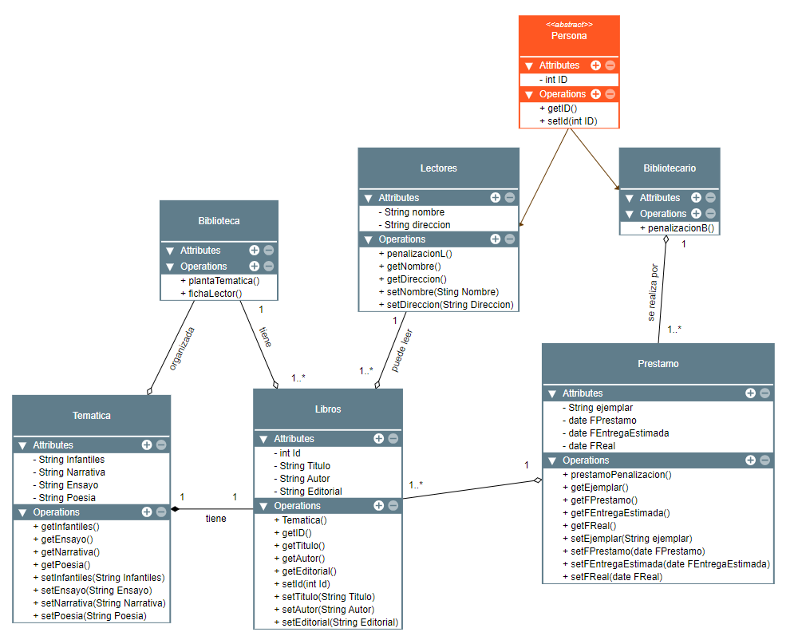

# **Examen 3 Evaluación Entornos de Desarrollo**
***Marc Morlá Isern***

----

## **Enunciado Examen:**

<h2 align="center"><b> LA BIBLIOTECA MUNICIPAL </b></h2>

Se desea modelar el funcionamiento de una biblioteca municipal, teniendo en cuenta que:

Los **libros** se organizan según la **temática**: libros infantiles, narrativa, ensayo, poesía, etc. Sabemos que cada temática se encuentra alojada en una **planta de la biblioteca**. Además, se deben registrar los libros que se encuentran en la biblioteca. Cada libro contará con un **identificador**, **titulo**, **autor**, **editorial**; por cada libro puede haber **más de un ejemplar** disponible para disponible para préstamo. Por cada **préstamo** deberá almacenarse el **ejemplar**, **la fecha de préstamo**, la **fecha de entrega estimada** y la **real**. El préstamo máximo será de 30 días. Los **lectores** que no entreguen el libro a tiempo tendrán **penalización**. Para aplicar esa penalización, la biblioteca cuenta con una ficha por cada lector, con su **número de identificación** o pasaporte, su **nombre** y su **dirección postal**. Para fomentar la lectura, los **empleados** de la biblioteca, que poseen su propia **identificación** como tales, pueden llevar libros a casa por un plazo mayot que los usuarios convencionales. Tambien es importante que el **préstamo del libro se realiza mediante un bibliotecario**.

En todo momento, debes indicar **getters**, **setters** y no es recomendable dejar ninguna clase sin **métodos**.

---
## **Clases:**
Con el enunciado podemos distinguir las siguientes clases a desarrollar:

- Biblioteca
- Libros 
- Tematica
- Prestamo
- Lectores
- Bibliotecario
- Persona << abstracta >>

---
## **Resultado Examen:**

